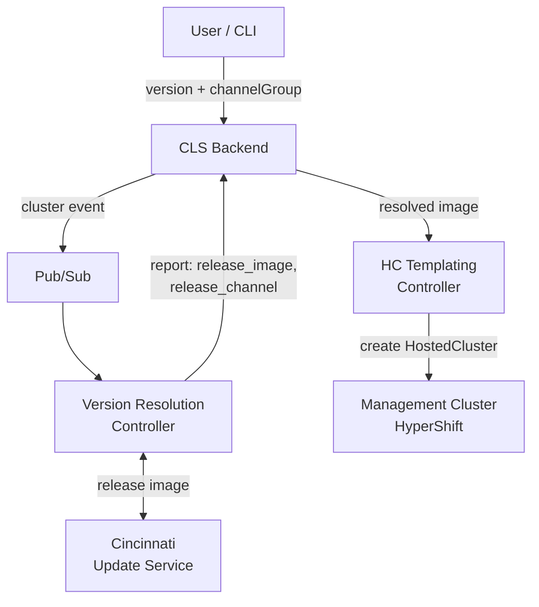

# GCP-562: Cincinnati Version Resolution — Demo Guide

> **Epic:** [GCP-562](https://redhat.atlassian.net/browse/GCP-562) — Adopt Cincinnati for cluster version resolution and upgrades
>
> **Purpose:** This document covers the full scope of the epic: version selection at cluster creation, Cincinnati integration, and cluster/nodepool upgrades.

---

## 1. Previous State and Limitations

**Before this epic**, the CLS Controller hardcoded a single release image in the Helm chart:

```yaml
# deployments/helm-cls-hypershift-client/templates/controllerconfig.yaml (BEFORE)
spec:
  release:
    image: quay.io/openshift-release-dev/ocp-release:4.20.0-x86_64
```

**Limitations:**
- Every cluster got the same OCP version — no user choice
- Changing the version required a Helm chart update and controller redeployment
- No way to target different channels (candidate, fast, stable) per environment
- Version changes were a manual, operator-driven process

---

## 2. Architecture Overview

The new architecture introduces a **version resolution controller** that sits between the user's version request and the HostedCluster creation.



**Key components:**
- **CLS Backend** — Stores `release.version` and `release.channelGroup` in the cluster spec
- **Version Resolution Controller** — Resolves version to release image via Cincinnati, reports as status metadata
- **HC Templating Controller** — Reads resolved image from VRC status, creates HostedCluster with correct image and channel
- **Cincinnati Update Service** — OpenShift service that maps versions to release image pullspecs

---

## 3. Cluster Creation with Version and Channel Group

The CLI now supports `--version` and `--channel-group` flags:

```bash
gcphcp clusters create --help
```

```
  --version TEXT                  OCP version for the cluster (e.g. 4.22.0,
                                  4.22.0-ec.4). If omitted, the backend
                                  default version is used.
  --channel-group [stable|fast|candidate|eus]
                                  Channel group for version resolution
                                  (default: stable). If omitted, the backend
                                  default is used.
```

```bash
gcphcp clusters create cveiga-upg1 --version 4.22.0-ec.4 --channel-group candidate --setup-infra --replicas=1
```

- `--version` specifies the exact OCP version (e.g., `4.22.0-ec.4`, `4.22.1`, `4.23.0`)
- `--channel-group` selects the Cincinnati channel stream (default: `stable`, options: `candidate`, `fast`, `stable`, `eus`)
- The backend stores both fields in the cluster spec and publishes a cluster event

---

## 4. Version Resolution Controller in Action

VRC log output after a cluster event, retrieved via `gcphcpctl`:

```bash
VRC_POD=$(gcphcpctl ops get pods -n cls-system --project int-reg-us-c1-nkcw 2>&1 | grep cls-version-resolution | awk '{print $2}')
gcphcpctl ops logs $VRC_POD -n cls-system --project int-reg-us-c1-nkcw --tail 200 | grep -E "Resolving|resolved"
```

```json
{"level":"info","msg":"Resolving version via Cincinnati","cluster_id":"da8fdf7c-...","version":"4.22.0-ec.4","channel_group":"candidate"}
{"level":"info","msg":"Version resolved successfully","cluster_id":"da8fdf7c-...","version":"4.22.0-ec.4","image":"quay.io/openshift-release-dev/ocp-release@sha256:b84ed0c8d9db452ca46c49572cb722a3224b53b252216b6eaa0d5eb8f8ee5d32","channel":"candidate-4.22"}
```

The Version Resolution Controller:
1. Receives the cluster event via Pub/Sub
2. Reads `spec.release.version` and `spec.release.channelGroup` from the cluster spec
3. Derives the Cincinnati channel name (e.g., `candidate` + `4.22.0-ec.4` → `candidate-4.22`)
4. Queries Cincinnati for the release image pullspec
5. Reports the result as status metadata:
   - `release_image` — the resolved pullspec (e.g., `quay.io/openshift-release-dev/ocp-release@sha256:...`)
   - `release_version` — the requested version (e.g., `4.22.0-ec.4`)
   - `release_channel` — the derived channel (e.g., `candidate-4.22`)
   - `release_channel_group` — the user's selected stream (e.g., `candidate`)

**Default configuration** (`values.yaml`):
```yaml
cincinnati:
  baseUrl: "https://api.openshift.com/api/upgrades_info/v1/graph"
```

---

## 5. Channel Propagation to HostedCluster

The HC Templating Controller reads the resolved channel from the VRC status and sets it on the HostedCluster spec:

```yaml
# HostedCluster CR (created by HC Templating Controller)
spec:
  release:
    image: quay.io/openshift-release-dev/ocp-release@sha256:b84ed0c8d9db452ca46c49572cb722a3224b53b252216b6eaa0d5eb8f8ee5d32
  channel: candidate-4.22
```

This enables the Cluster Version Operator (CVO) to:
- Know which channel to watch for updates
- Report available upgrades within that channel
- Validate version compatibility

---

## 6. Resolved Image in Cluster Status

The resolved image is stored in the controller status metadata. We can verify the cluster status via the CLI:

```bash
gcphcp clusters status cveiga-upg1
```

```
Cluster ID            0c949b91-38c7-4c7c-b9b6-0d681812686a
Cluster Name          cveiga-upg1
Project               cveiga-gcp-hcp-2
Created By            cveiga@redhat.com

Current Status
  Phase               Ready
  Generation          1 (up to date)

Conditions
  Ready               True
  Available           True
```

The VRC status metadata (stored in the backend) contains:
```json
{
  "release_image": "quay.io/openshift-release-dev/ocp-release@sha256:...",
  "release_version": "4.22.0-ec.4",
  "release_channel": "candidate-4.22",
  "release_channel_group": "candidate"
}
```

---

## 7. Available Upgrades

With `spec.channel` set on the HostedCluster, the CVO automatically queries Cincinnati and reports available upgrades in the HostedCluster status:

```bash
gcphcpctl ops get hc cveiga-upg2 -n clusters-da8fdf7c-... --project int-mgt-us-c1-yjiv -o yaml
```

```json
{
  "availableUpdates": [
    {
      "channels": ["candidate-4.22", "candidate-5.0"],
      "image": "quay.io/openshift-release-dev/ocp-release@sha256:354270...",
      "version": "4.22.0-ec.5"
    }
  ],
  "desired": {
    "channels": ["candidate-4.22", "candidate-5.0"],
    "image": "quay.io/openshift-release-dev/ocp-release@sha256:b84ed0c...",
    "version": "4.22.0-ec.4"
  },
  "history": [
    {
      "completionTime": "2026-04-14T18:45:20Z",
      "state": "Completed",
      "version": "4.22.0-ec.4"
    }
  ]
}
```

This completes the core scope of the epic — version selection, resolution, and upgrade visibility.

---

## Experiment: Cluster and NodePool Upgrades

Upgrades are out of scope for this epic — GCP-562 covers version selection at cluster creation only. However, we built a basic upgrade prototype to start the discussion on how we want to handle upgrades going forward. The following is experimental and based on a draft CLI PR.

> **Draft PR:** [apahim/gcp-hcp-cli#25](https://github.com/apahim/gcp-hcp-cli/pull/25) — Basic upgrade support (experimental)

### 8. Identify Available Upgrades via CLI

The `clusters describe upgrade` command shows the current version and available upgrade paths:

```bash
gcphcp clusters describe upgrade cveiga-upg1
```

```
Cluster:            cveiga-upg1
Version:            4.22.0-ec.4
Progress:           Completed
Updating Version:   False
Message:            Cluster version is 4.22.0-ec.4

Available Updates:
  - 4.22.0-ec.5
```

### 9. Trigger and Monitor an Upgrade

Trigger a cluster upgrade:

```bash
gcphcp clusters upgrade cveiga-upg1 --version 4.22.0-ec.5
```

```
Upgrading cluster 'cveiga-upg1' to version 4.22.0-ec.5...
✓ Upgrade initiated. Use 'gcphcp clusters describe upgrade cveiga-upg1' to monitor progress.
```

The upgrade flow:
1. The CLI updates `spec.release.version` on the cluster via `PUT /api/v1/clusters/{id}`
2. The VRC resolves the new version to a release image (`sha256:354270...`)
3. The HC Templating Controller updates the HostedCluster spec
4. The CVO begins the control plane upgrade

The VRC logs confirm the new version resolution:

```bash
gcphcpctl ops logs $VRC_POD -n cls-system --project int-reg-us-c1-nkcw --tail 200 | grep -E "Resolving|resolved"
```

```json
{"level":"info","msg":"Resolving version via Cincinnati","cluster_id":"da8fdf7c-...","version":"4.22.0-ec.5","channel_group":"candidate"}
{"level":"info","msg":"Version resolved successfully","cluster_id":"da8fdf7c-...","version":"4.22.0-ec.5","image":"quay.io/openshift-release-dev/ocp-release@sha256:354270425f0cb661d5723910eb9d5ab7bd9510cdff43919c32695849bf0599f4","channel":"candidate-4.22"}
```

Monitor progress in real-time:

```bash
gcphcp clusters status cveiga-upg1 --watch
```

### 10. Upgrade Status of HostedCluster and NodePool

During the upgrade, we can monitor progress for both the cluster and nodepool:

```bash
gcphcp clusters describe upgrade cveiga-upg1
```

```
Cluster:            cveiga-upg1
Version:            4.22.0-ec.4 → 4.22.0-ec.5
Progress:           Partial
Updating Version:   True
Message:            Working towards 4.22.0-ec.5: 451 of 693 done (65% complete),
waiting on network

No available updates.
```

```bash
gcphcp nodepools describe upgrade cveiga-upg1-nodepool-1 --cluster cveiga-upg1
```

```
NodePool:           cveiga-upg1-nodepool-1
Cluster:            cveiga-upg1
Version:            4.22.0-ec.4 → 4.22.0-ec.5
Updating Version:   True
Ready:              True
```

Key conditions to watch:
- **Cluster:** `Progress` changes from `Partial` to `Completed`, `Updating Version` goes to `False`
- **NodePool:** `Version` updates to new version, `Updating Version` goes to `False`, `Ready` returns to `True`

### 11. Upgrade Complete

Once the upgrade finishes, both cluster and nodepool are at the new version:

```bash
gcphcp clusters describe upgrade cveiga-upg1
```

```
Cluster:            cveiga-upg1
Version:            4.22.0-ec.5
Progress:           Completed
Updating Version:   False
Message:            Cluster version is 4.22.0-ec.5

No available updates.
```

```bash
gcphcp nodepools describe upgrade cveiga-upg1-nodepool-1 --cluster cveiga-upg1
```

```
NodePool:           cveiga-upg1-nodepool-1
Cluster:            cveiga-upg1
Version:            4.22.0-ec.5
Updating Version:   False
Ready:              True
```

The demo concludes with both the cluster and nodepool upgraded to `4.22.0-ec.5`, and no additional upgrades available in the `candidate-4.22` channel.

---

## Items for Discussion and Next Steps

The following are working assumptions based on early team discussions.

### Control Plane First Upgrade Ordering

Currently, a cluster upgrade triggers both control plane and nodepool upgrades simultaneously. The nodepool can finish upgrading before the control plane, which is not a supported configuration (kubelets should never be ahead of the API server). The team agreed on a **control plane first** approach: upgrade the control plane, and once it succeeds, the nodepool controller detects the nodepool is falling behind and triggers the nodepool upgrade to catch up. This is the same model GKE uses.

### Cincinnati as the Single Source of Truth

Cincinnati should be the authoritative source for version resolution — no cluster image sets, no custom abstraction layers. Past experience has shown that re-implementing Cincinnati resolution logic causes significant issues. Where possible, we should reuse existing libraries rather than re-implementing version resolution.

### Pre-production Version Support

Beyond production Cincinnati (`api.openshift.com`), we need to support pre-production scenarios: CI builds, nightlies, and custom assemblies via the release controller (which also speaks the Cincinnati protocol). The architecture should allow pointing to different Cincinnati endpoints per environment (e.g., release controller for int/dev, production Cincinnati for stage/prod). Additionally, Red Hatters should be able to inject arbitrary release image URLs in non-production environments for testing custom assemblies.

### Automatic Upgrade Policies

The team wants to align with the GKE model: once a new target version is defined, all clusters upgrade to it automatically, respecting customer-defined maintenance windows. This is preferred over the current ROSA approach of force-upgrading only when versions approach end-of-life. This is a Q3/Q4 initiative with a dedicated feature/epic for the full upgrade story.

### HostedCluster Available Upgrades as Source of Truth

The available upgrades reported in the HostedCluster CR status (resolved by the CVO via Cincinnati) should be trusted as the source of truth for what a cluster can upgrade to. If those available upgrades are incorrect, the fix belongs in the CVO/Cincinnati resolution, not in a custom validation layer.

### CLM Integration

The version resolution pattern implemented in CLS (adapter-based, Cincinnati-backed) is expected to carry over to CLM (Cluster Lifecycle Manager). The CLS implementation serves as a prototype — CLM will need a comprehensive implementation following the same principles (Cincinnati as source of truth, adapter-based resolution) but with full upgrade lifecycle support. Keeping alignment between the CLS and CLM approaches will ensure a smooth transition.

### Scope and Timeline

Upgrades are a deep topic with many dimensions (node autoscaling, Karpenter interaction, maintenance windows, customer controls). The current CLS implementation is a pragmatic shortcut; the full upgrade system will be designed and implemented in CLM. A dedicated feature for upgrades will be created to track this work separately.
